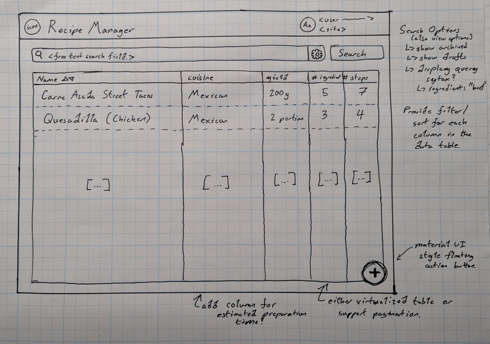
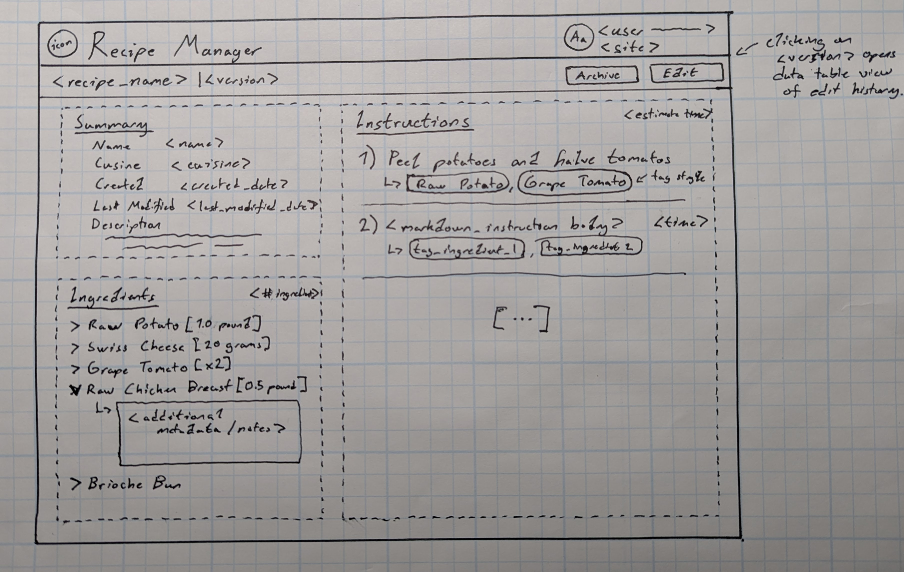
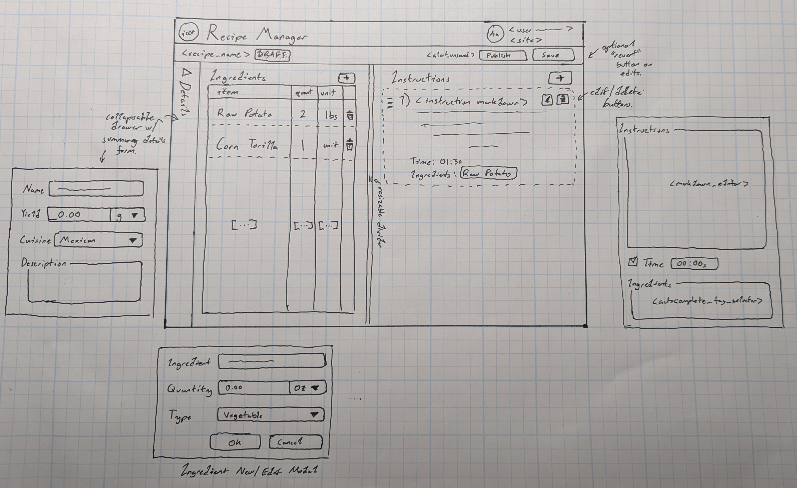
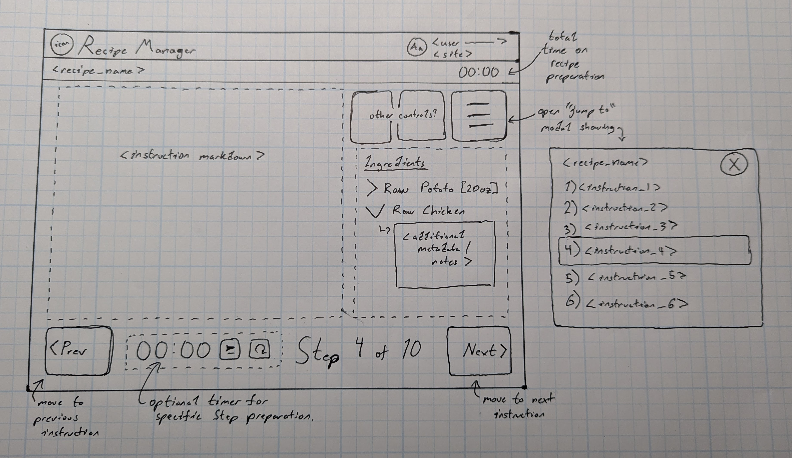

# ubiquitous-potato
_Note: I was tickled that this random generated repo name was oddly appropriate so I kept it._

## Overall Requirements
See more requirement details & discussion [here](docs/assignment.md).

### Expected Load Assumptions
- Between 5k to 10k requests/day.
- Max recipes ~1000.
- Several dozen users concurrent (assume ~100 max).
- Bursty QPS at unpredictable timeframes.

## Proposed Design

### Database & Data Model

Intending to use a standard relational database to maintain the recipe information (postgresql / mysql / etc). Given the low overall quanity of expected recipes a document database or other NoSQL approach may be reasonable (and more initially cost effective depending on choice of technology relative a postgresql server for instance), but from experience all NoSQL databases eventually evolve into something relational out of necessity. Starting with a relational database gives a better foundation to build off of for eventual feature improvements and provides access to triggers to streamline audit history creation and views to easily provide interesting or relevant subsets of data to specific users or user groups (a mexican restaurant shouldn't probably be looking at recipes for italian food). It also provides better performance for query heavy features like search and aggregation for metrics either from a customer or maintenance perspective.

For ease of use and additional flexibility in evolving the database schema over time, would rely on a database migration tool such as [migrate](https://github.com/golang-migrate/migrate) to facilitate reliable management of the relational database.

#### Recipe Table (`potato.recipe`)

Considering a "recipe" to be a collection of:
- General metadata associated with the recipe (yield / classification / etc).
- Versioning information (keep versioned copies of each recipe for auditability and history information).
- List of instructions (steps needed to produce the recipe).
- List of ingredients (raw materials consumed by the recipe).

| Column | Type | Description |
| ------ | ---- | ---------- |
| recipe_id | GUID | primary key |
| version | Int | integer version number of the recipe |
| state | Enum | `DRAFT` / `PUBLISHED` / `ARCHIVED` - denotes the overall state of the recipe entry, draft indicating a user is in the process of editing the recipe and published/archived representing a finalized version. use archived to ensure that recipe removal is ultimately non-destructive and can be easily reverted. |
| latest | Boolean | ease of use flag to streamline retrieval of only the most recent version of a recipe. |
| cuisine | Enum or Text | `MEXICAN` / `THAI` / etc, categorization of the recipe. can be used in relevant data views for specific sites or kitchens. |
| description | Text | generic description of the dish created by the recipe, can be used downstream for menu application integration. |
| yield | Float | overall yield of the recipe in either portions or a standardized measure like grams. tending on the side of using "portions" as a measure to convey the number of overall customer servings a recipe yields. |
| ingredients | JSONB | json blob, list of ingredients (see "Schema for Ingredient" below). |
| instructions | JSONB | json blob, list of instructions (see "Schema for Instructions" below). |
| created_by | GUID | foreign key (`potato.user`), reference to the user who initially created this recipe |
| created_timestamp | Timestamp | creation timestamp for the original recipe |
| last_modified_by | GUID | foreign key (`potato.user`), reference to the user who last modified this recipe |
| last_modified_timestamp | Timestamp | timestamp of the last modification (if in draft, last modification by a user | if in published or archived, functional publishing timestamp). could see breaking this out into a seperate `published_timestamp` |

I can see an entirely valid argument to break out `steps` and `ingredients` into their own tables depending on the requirements for how each need to be treated. For the time being I'm taking the approach of embedding them as json blobs within recipe entries for the following reasons:
- Lessens the complexity of handling versioning and updates on the `ingredient` / `instruction` side when modifying recipes for simplicity's sake.
- `steps` and `ingredients` are not likely to be shared across recipes and are only ever accessed or mutated in context of the `recipe` they're associated with.
- There is minimal value in optimizing for search of recipes based on ingredient contents / step contents. Given the expected recipe quantity SQL queries over the JSON columns - though not optimal - should be sufficent (would want to reconsider this depending on the search requirements / if more scale is expected to be required).
- The individual `ingredient` and `instruction` are generally lightweight in the proposed formats.

Other things that could be interesting to track here:
- Potentially revising to represent the concept of `cuisine` as a tag attached to the recipe. This would be more robust for the situation where multiple categorizations are desired to be applied to a single recipe to improve search and discoverability (ie, mexican && vegitarian && gluten-free). It would also be a good method for representing additional metadata on the recipe similar to "glutten-free" options/classifications.
- There's a lot of potential for interesting complexity here in terms of handling variations of recipes and/or sharing variations of recipes between specific sets of users / sites.

**Schema for Ingredient:**
``` json
{
    "ingredient_id": 1,
    "ingredient_name": "Raw Potato",
    "type": "vegetable", // enum describing primary category of ingredient (meat / vegetable / seasoning / etc)
    "quantity": 1.0,
    "quantity_units": "lbs" // enum or raw string providing units
}
```

Would initially want to standardize quantity to SI units for sanity's sake on the backend and translate them on the fly into whatever standard units are relevant for the given group / site (imperial / metric / etc). This may be more complicated than it seems however depending on the level of standardization for ingredient units that can be expected in any given situation, so providing a reasonable fallback to have the user encode the units for quantity and simply propagating those values throughout.

Other things that could be interesting to track here:
- Handling instructions (ex: this is raw meat - do not cross contaminate).
- Allergen information (ex: contains peanuts).
- Food safety requirements / information:
    - Keep hot / keep cold / temperature needs.
    - Shelf life / freshness info (max time until unusable).
- Prep instructions (do not use if browning / cut diagonally only / etc).

**Schema for Instruction:**
``` json
{
    "instruction_id": 1,
    "ingredients": [1, ...], // list of ingredient_ids
    "instruction_body": "Wash and peel the potato.", // markdown formatted instructions for the actions a user should perform
    "timing_s": -1, // timing metadata for the step, relevant for "sautee for 10 minutes" format instructions
}
```

Considerations:
- Use markdown as the format for storing the `instruction_body` values given it's a generally well supported markup language and should cover the vast majority of formatting requirements for displaying each instruction in an easily user digestable way.
- Encode additional timing related metadata for each `instruction` for use on the UX (show / track time counters & warn users if time bounds are exceeded with some level of tolerance), adds additional flexibility to aggregate nominal recipe end to end preparation time.

Other things that could be interesting to track here:
- Additional notes (not relevant specifically for recipe / food preparation but maybe for recipe management?).
- Pictures or other reference information relevant to the current instruction.

#### Users Table (`potato.user`)
| Column | Type | Description |
| ------ | ---- | ---------- |
| user_id | GUID | primary key  |
| kitchen_id | GUID | foreign key (`potato.kitchen`) |
| first_name | Text | string firstname of user |
| last_name | Text | string lastname of user |

Other things that could be interesting to track here:
- User roles / permissions (assuming that not every user / employee should have permission to change recipes for their kitchen - more information about how the application is intended to be used by employees at each kitchen can clarify).
- Reference to user avatar images / similar branding and user differentiation.

#### Site / Kitchen Table (`potato.kitchen`)
| Column | Type | Description |
| ------ | ---- | ---------- |
| kitchen_id | GUID | primary key |
| group_id | GUID | foreign key (`potato.group`) |
| display_name | Text | string display name of the kitchen / site |

Other things that could be interesting to track here:
- Kitchen branding information.
- Category for the kitchen (cuisine type or other relevant categorization to differentiate )

#### Group Table (`potato.group`)
| Column | Type | Description |
| ------ | ---- | ---------- |
| group_id | GUID | primary key |
| display_name | Text | string display name of the kitchen / restaurant group |

Considering representing the overall group > kitchen / site > user relationship more as an exercise in future proofing the design for the potential complexity of storing and restricting access to recipes depending on the requirements of how recipes are intended to evolve over time relative the groups / sites that create and maintain them.

#### Audit (`potato.audit`)
| Column | Type | Notes |
| ------ | ---- | ---------- |
| audit_id | GUID | primary key |
| recipe_id | GUID | foreign key (`potato.recipe`) |
| action | Enum | `CREATE` / `ARCHIVE` / `UNARCHIVE`/ `EDIT` |
| action_by | GUID | foreign key (`potato.user`) |
| action_timestamp | Timestamp | timestamp of the user action |
| description | Text | generic notes for what happened |

### Backend

For core functionality a simple RESTful API
Consider something more scalable like a go based GRPC server if the scale / load requirements are greater.

| Category | Method | Endpoint | Returns | Description |
| -------- | ------ | -------- | ------- | ----------- |
|

To handle updates, either open WS or use SSE - polling as an initial approach due to small number of expected clients (fine with db load).

### Frontend

For the frontend application, use a simple React application due to it's prevelance and wide spread support and available libraries. The proposed web application does not have any particular constraints with regards to high throughput data visualization or particularly unique reactivity requirements so a standard React shell should be sufficient.

#### Recipe Management Views
The recipe management view is oriented around recipe search and discovery. Use a data table to respresent the visible recipes for a given user / site combination and provide standard sorting / filtering behavior. Search functionality can be handled by bare search queries using a simple search syntax to provide additional constraints on specific parts of a recipe (ie: `ingredient:"beef"` searches for recipes that use an ingredient that matches the search string "beef"). Table entries directly link to the "Recipe Introspection View".



#### Recipe Introspection View
The recipe introspection view is geared towards providing at a glance summary of the recipe including all ingredients and instruction steps to prepare the recipe.



#### Recipe Creation / Edit Views
All recipe creation and edit workflows use the same view to represent a mutable entity of the recipe. Consideration is taken to ensure that both `ingredients` and `instructions` are editable and visible at the same time since recipe creation can concievably include modifying both in concert (user adds a new instruction step and simultaneously adds the ingredients it uses.)

Other things that could be interesting to track here:
- Indication that an included ingredient isn't being used in any of the defined instruction steps.
- Running estimate of required preparation time.
- Analysis / indication of conflicting ingredients (X and Y should never be combined because one is raw?).



#### Recipe Preparation Views
The recipe preparation view is geared towards providing a streamlined interface for a user who is undergoing preparation of a chosen recipe. This focuses on large controls for easy manipulation while doing other things (working with food etc) and focusing on the stepwise workflow of preparing a recipe into a resultant meal.



### Auxillary Tech Stack

#### Deployment
Containerize web application's frontend and backend, then for ease of use rely on AWS EKS or Lightsail style services to streamline deployment and handling. However given the lower requirements for overall concurrent users and request load a purely serverless architecture may be more cost effective.

#### Insturmentation
Use standard prometheus / grafana insturmentation setup given large scale support for these technologies and high availably of 3rd party tooling to provide operational metrics and status. Would additionally consider an application level error tracking platform similar to Sentry to provide coverage of exception / error events.
